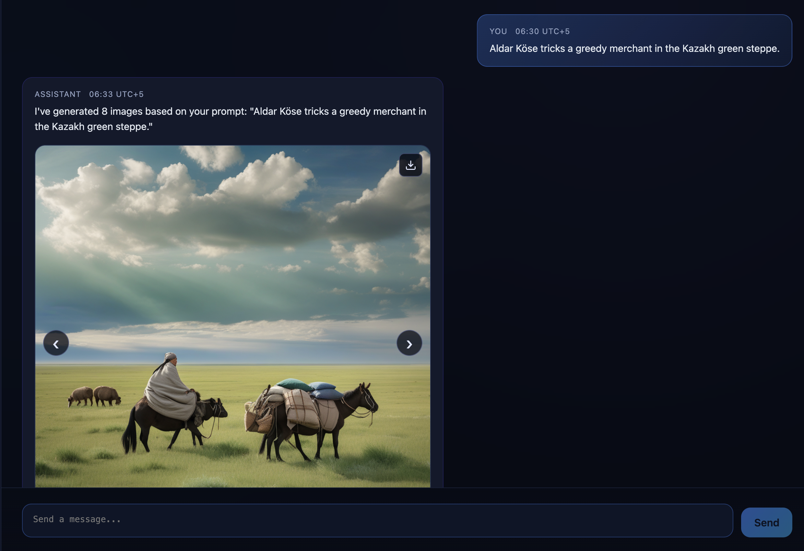

# lcc-aldar-kose
"Aldark Kose Storyboard" project from HackNU 2025




### Colab

[📓 Notebook without integrated prompt optimizations](txt2img_img2img_inference.ipynb)

## Docker Quickstart

```bash
cp .env.example .env # update credentials as needed
docker compose up --build -d
```

The command starts the core services:

- Frontend: http://localhost:5173 (Vite dev server)
- Backend: http://localhost:8000 (FastAPI + SQLite)
- MinIO Console: http://localhost:9001 (S3-compatible storage UI, API on :9000)

The frontend runs with mocked assistant replies (`VITE_USE_MOCK=true`) so you always see responses while the real model is offline. Flip it to `false` in `docker-compose.yml` once the backend generates replies. The backend SQLite volume is persisted under `backend/data`. Stop the stack with `Ctrl+C`.

## ML Microservice

The GPU inference service lives under `ml/service.py`. It handles storyboard generation, talks to the backend for status updates, and streams image URLs from MinIO/S3. To run it locally:

```bash
pip install -r ml/requirements.txt
python ml/service.py
```

The service expects MinIO (or an S3-compatible store) to be available. Populate a `.env` file based on `.env.example`, making sure these variables point at your MinIO instance and OpenAI creds:

- `MINIO_ROOT_USER` – MinIO admin username (used by both Docker and the ML service)
- `MINIO_ROOT_PASSWORD` – MinIO admin password
- `AWS_ACCESS_KEY_ID` – S3 access key the ML service uses for presigned URLs (often same as root user)
- `AWS_SECRET_ACCESS_KEY` – Matching S3 secret key
- `AWS_ENDPOINT_URL` – MinIO/S3 endpoint (default `http://localhost:9000`)
- `OPENAI_API_KEY` – API key for GPT planning requests
- `GPU_SERVICE_URL` – Location of the ML microservice (default `http://host.docker.internal:8081` when running backend inside Docker)

Start MinIO first (docker compose will handle it) so the ML service can upload frames. Once the microservice is up, the backend can dispatch generation jobs to it automatically.
